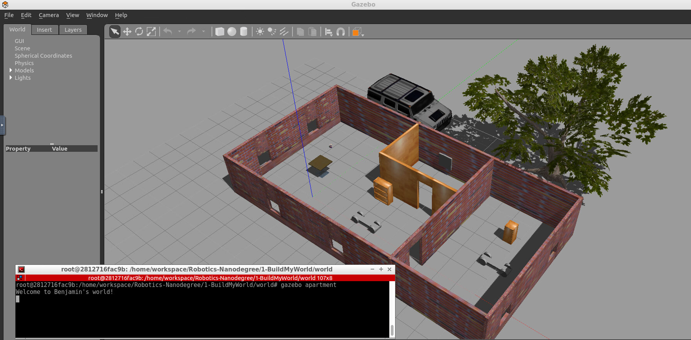

# Project 1 - Build My World

Pick a place where you want to deploy your robot, for example: your apartment, your office, or your favorite restaurant. In addition, create any model of your choice and import a model from the Gazebo library.

## Summary of Tasks

1. Build a single floor wall structure using the Building Editor tool in Gazebo. Apply at least one feature, one color, and optionally one texture to your structure. Make sure there's enough space between the walls for a robot to navigate.
2. Model any object of your choice using the Model Editor tool in Gazebo. Your model links should be connected with joints.
3. Import your structure and two instances of your model inside an empty Gazebo World.
4. Import at least one model from the Gazebo online library and implement it in your existing Gazebo world.
5. Write a C++ World Plugin to interact with your world. Your code should display “Welcome to ’s World!” message as soon as you launch the Gazebo world file.

## Submission Folder

Here are the files that you need to include in your project submission folder:

 - model folder:
Any object or robot designed in the Model Editor tool of Gazebo
A single floor structure designed in the Building Editor tool of Gazebo
 - world folder:
Gazebo world file that includes the models
 - script folder:
Gazebo world plugin C++ script
 - CMakeLists.txt file to link the C++ code to libraries# Robotics_Software_Engineer_Nanodegree-Udacity
 
 ## Deployment
 ```
 cd 1-BuildMyWorld/world
 gazebo apartment
 ```
 
 ## Example
 
 
